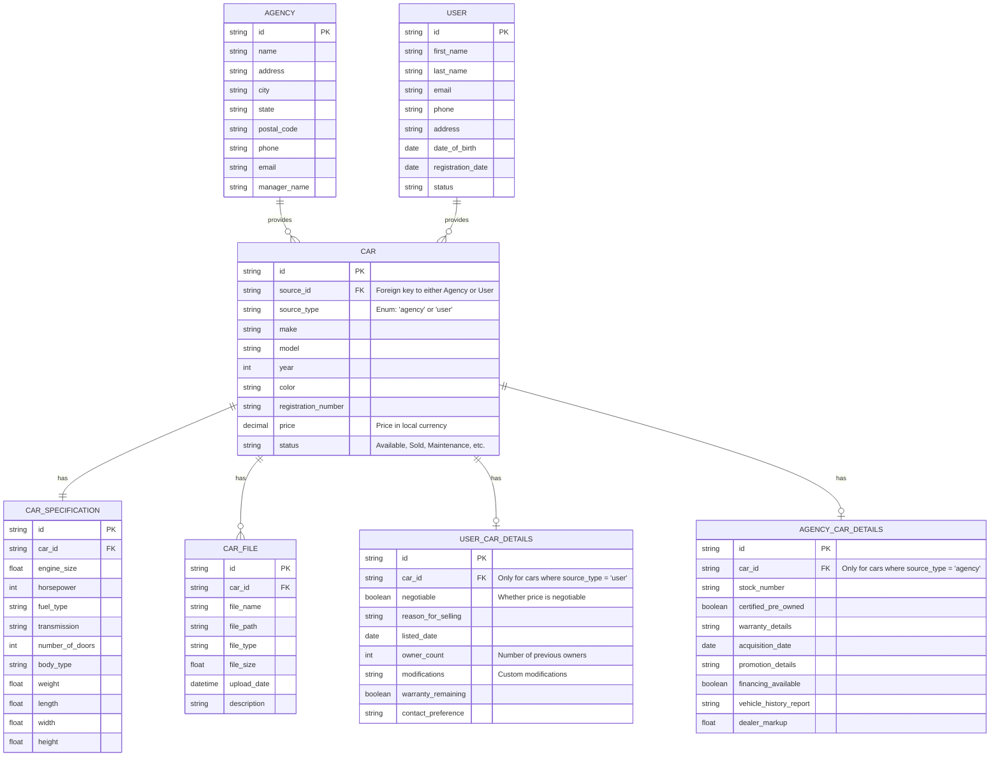

# Car Database ERD

## Entity Descriptions

### Agency

Represents a car dealership, rental agency or any business entity that provides cars.

- **id**: Unique identifier for the agency
- **name**: Name of the agency
- **address**: Street address
- **city**: City where located
- **state**: State/province where located
- **postal_code**: Postal/ZIP code
- **phone**: Contact phone number
- **email**: Contact email address
- **manager_name**: Name of the manager

### User

Represents an individual user who can provide cars to the catalog.

- **id**: Unique identifier for the user
- **first_name**: User's first name
- **last_name**: User's last name
- **email**: User's email address
- **phone**: User's phone number
- **address**: User's physical address
- **date_of_birth**: User's date of birth
- **registration_date**: Date when the user registered
- **status**: Current status of the user (e.g., active, inactive)

### Car

Represents a car in the unified catalog, sourced from either an agency or user.

- **id**: Unique identifier for the car
- **source_id**: Foreign key referencing either the Agency or User entity
- **source_type**: Enum indicating whether the car is from an 'agency' or 'user'
- **make**: Manufacturer of the car (e.g., Toyota, Ford)
- **model**: Model name of the car (e.g., Corolla, F-150)
- **year**: Year the car was manufactured
- **color**: Color of the car
- **registration_number**: Official registration number
- **price**: Price of the car in local currency
- **status**: Current status of the car (e.g., available, sold, maintenance)

### Car Specification

Contains detailed technical specifications for a car.

- **id**: Unique identifier for the specification record
- **car_id**: Foreign key referencing the Car entity
- **engine_size**: Size of the engine in liters
- **horsepower**: Engine power in horsepower
- **fuel_type**: Type of fuel used (e.g., gasoline, diesel, electric)
- **transmission**: Type of transmission (e.g., automatic, manual)
- **number_of_doors**: Number of doors
- **body_type**: Type of car body (e.g., sedan, SUV, hatchback)
- **weight**: Weight of the car in kg
- **length**: Length of the car in mm
- **width**: Width of the car in mm
- **height**: Height of the car in mm

### Car File

Stores images and videos related to a car.

- **id**: Unique identifier for the file record
- **car_id**: Foreign key referencing the Car entity
- **file_name**: Name of the file
- **file_path**: Path where the file is stored
- **file_type**: Type of file (e.g., image/jpeg, video/mp4)
- **file_size**: Size of the file in MB
- **upload_date**: Date and time when the file was uploaded
- **description**: Optional description of the file

### User Car Details

Stores user-specific details for cars provided by users.

- **id**: Unique identifier for the user car details record
- **car_id**: Foreign key referencing the Car entity
- **negotiable**: Whether the price is negotiable
- **reason_for_selling**: Reason for selling the car
- **listed_date**: Date the car was listed for sale
- **owner_count**: Number of previous owners
- **modifications**: Custom modifications
- **warranty_remaining**: Whether the warranty is remaining
- **contact_preference**: Preferred contact method

### Agency Car Details

Stores agency-specific details for cars provided by agencies.

- **id**: Unique identifier for the agency car details record
- **car_id**: Foreign key referencing the Car entity
- **stock_number**: Agency's internal stock number for the vehicle
- **certified_pre_owned**: Whether the car is certified pre-owned
- **warranty_details**: Details about warranty coverage
- **acquisition_date**: Date when the agency acquired the car
- **promotion_details**: Current promotions or special offers
- **financing_available**: Whether financing options are available
- **vehicle_history_report**: Link or reference to vehicle history report
- **dealer_markup**: Additional markup applied by the dealer

## Relationships

- Each Agency can provide zero or many Cars
- Each User can provide zero or many Cars
- Each Car is provided by exactly one source (either an Agency or a User)
- Each Car has exactly one Car Specification
- Each Car Specification belongs to exactly one Car
- Each Car can have zero or many Car Files
- Each Car File belongs to exactly one Car
- Each User can have zero or many User Car Details
- Each User Car Detail belongs to exactly one Car
- Each Car may have zero or one Agency Car Details
- Each Agency Car Detail belongs to exactly one Car

## Unified Car Catalog Concept

This model implements a unified car catalog where:

1. Cars from both agencies and individual users are stored in a single CAR table
2. The source_type field distinguishes whether a car comes from an agency or a user
3. The source_id references either an Agency ID or User ID depending on the source_type
4. All cars share the same structure for specifications and associated files
5. Agency-specific and user-specific details are stored in separate tables
6. Queries can easily filter by source type when needed or treat all cars uniformly
